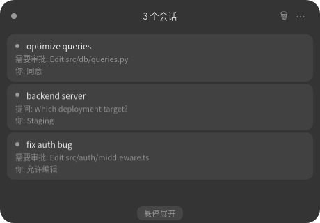

# Deepin AI Island v1.0.0

一款专为 Linux（Deepin/DDE）打造的 AI Agent 监控工具，以"屏幕顶部中央浮动胶囊"（灵动岛模式）作为核心 UI，让用户在 AI Agent 工作时无需切换终端即可监控进度、批准操作和回答问题。

## 功能特性

- **Dynamic Island 风格动画** — 使用 `setMask` + CSS `transition` 实现丝滑流畅的展开/收起动画，彻底消除抖动
- **实时会话监控** — 自动发现 Claude Code 会话，启动时立即加载已有活跃会话
- **多行对话摘要** — 悬停会话卡片自动展开显示最近 3 行聊天记录摘要
- **Markdown 渲染** — 支持在详情面板中渲染 Markdown 格式的消息内容
- **状态点脉冲动画** — 运行中会话的状态指示器带有呼吸灯脉冲效果
- **快捷审批** — 展开列表中直接显示拒绝 / 允许一次 / 允许所有按钮，无需进入详情页
- **自动批准规则** — 点击会话卡片上的 "A" 按钮，同类权限请求将自动放行
- **审批自动弹窗** — 新权限请求到来时自动展开列表（非详情页），5 秒后自动缩回
- **智能排序** — 待审批会话置顶，运行中会话其次，已完成/空闲最后
- **实时状态同步** — 准确反映 AI 空闲、处理中、等待审批、等待回答等状态
- **会话名称** — 自动使用工作目录名称作为会话标识，便于区分多个会话
- **终端跳转** — 点击会话卡片直接跳转到对应的终端窗口（tmux / 普通终端）
- **插件系统** — 支持声音提示等插件扩展，可自定义审计、自动化规则

## 界面预览

### 紧凑模式（顶部胶囊）


### 展开模式（会话列表）



## 安装方式

### 方式一：deb 包安装（推荐）

下载 `deepin-ai-island_v1.0.0_amd64.deb`，双击安装或使用命令：

```bash
sudo dpkg -i deepin-ai-island_v1.0.0_amd64.deb
```

安装后从启动器运行 "AI Island"。

### 方式二：源码运行

```bash
# 1. 克隆仓库
cd deepin-ai-island

# 2. 创建虚拟环境
python3 -m venv .venv
source .venv/bin/activate

# 3. 安装依赖
pip install -r requirements.txt

# 4. 启动 AI Island（连接 Claude Code 真实事件）
python island_ui/main.py
```

### 方式三：直接运行可执行文件

解压 `deepin-ai-island_v1.0.0_linux_x64.tar.gz` 后运行：

```bash
./deepin-ai-island
```

## 运行模式

### Claude Code 模式（默认）

自动连接本地运行的 Claude Code 会话，通过 Unix Socket (`/tmp/ai-island.sock`) 接收实时事件。

**前置条件：**
- 已安装 Claude Code CLI
- 已安装 AI Island Hook（首次使用需执行安装命令）

**安装 Hook：**

```bash
source .venv/bin/activate
python claude_hooks/install.py install
```

安装完成后，**必须重启 Claude Code** 才能生效（Claude Code 只在启动时读取一次 `settings.json`）。

如需卸载 Hook：

```bash
python claude_hooks/install.py uninstall
```

## 交互说明

启动后，屏幕顶部中央将出现一个浮动胶囊：

1. **悬停胶囊** — 自动展开会话列表，显示最近 3 行聊天记录摘要
2. **点击会话卡片** — 直接跳转到该会话所在的终端窗口
3. **点击"需要回答"** — 点击提问卡片上的"需要回答: ..."文本，进入详情面板进行回答
4. **权限审批** — 展开列表中会话卡片底部直接显示快捷审批按钮（拒绝 / 允许一次 / 允许所有）
5. **自动批准** — 点击会话卡片上的 "A" 按钮，当前会话的同类权限请求将自动放行
6. **审批自动弹窗** — 新权限请求到来时自动展开列表，5 秒后自动缩回
## 项目结构

```
deepin-ai-island/
├── island_ui/                 # PySide6 桌面应用核心
│   ├── main.py                # 入口程序
│   ├── island_window.py       # 主窗口：无边框、置顶、QWebChannel 桥接、setMask 动画
│   ├── web/                   # 前端页面（HTML/CSS/JS，内嵌无外部服务器）
│   │   ├── island.html        # 主胶囊页面（CSS transition 动画 + 会话列表）
│   │   └── expanded.html      # 详情面板页面（Markdown 渲染 + 聊天记录）
│   ├── claude_code_source.py  # Claude Code Hook 事件源（Unix Socket 服务器）
│   ├── event_source.py        # EventSource ABC
│   ├── state_machine.py       # IDLE/COMPACT/EXPANDED 三状态机
│   ├── events.py              # 事件数据模型（Pydantic）
│   ├── session.py             # 会话模型（状态转换、事件聚合）
│   ├── card_factory.py        # 事件类型 → 卡片工厂
│   ├── cards/                 # 事件卡片组件
│   │   ├── base_card.py       # EventCard 基类
│   │   ├── permission_card.py # 权限请求卡片
│   │   ├── question_card.py   # 提问卡片
│   │   └── session_list_item.py # 会话列表条目
│   ├── theme.py               # 主题管理（深色/浅色）
│   ├── animations.py          # 动画工具
│   ├── config_manager.py      # YAML 配置管理
│   ├── plugin.py              # 插件接口定义
│   ├── plugin_loader.py       # 插件加载器
│   └── plugins/               # 内置插件
│       └── sound_plugin.py    # 声音提示插件
├── claude_hooks/              # Claude Code Hook 脚本
│   ├── ai_island_hook.py      # Hook 主脚本（stdin → Unix Socket）
│   └── install.py             # Hook 安装/卸载工具
├── island_daemon/             # 守护进程（预留，Phase 3）
│   ├── ipc_server.py          # asyncio Unix Socket 服务器（空壳）
│   └── session.py             # 守护进程会话管理
├── adapters/                  # Agent 适配器（预留，Phase 3）
│   └── base.py                # AgentAdapter 抽象基类
├── config/
│   └── default.yaml           # 窗口位置、动画开关、超时时间、音效配置
├── tests/                     # 单元测试
│   ├── test_events.py
│   ├── test_event_source.py
│   ├── test_state_machine.py
│   ├── test_session.py
│   ├── test_theme.py
│   ├── test_config.py
│   ├── test_ask_user_question.py
│   ├── test_sound_plugin.py
│   └── test_clear_completed.py
├── docs/                      # 文档与截图
│   ├── screenshots/           # README 界面截图
│   └── superpowers/           # 设计文档与规格
├── requirements.txt
├── build_deb.sh               # deb 打包脚本
├── build.py                   # PyInstaller 打包脚本
├── deepin-ai-island.spec      # PyInstaller 规格文件
└── README.md
```

## 技术栈

- **UI 框架**: PySide6 (Qt6) + QWebEngineView + QWebChannel
- **前端**: 原生 HTML5 / CSS3 / JavaScript（内嵌，无需外部服务器）
- **动画**: Qt `setMask(QRegion)` + CSS `transition` + `cubic-bezier(0.22, 1, 0.36, 1)`
- **运行时**: Python 3.12+
- **数据模型**: Pydantic v2
- **IPC**: Unix Domain Socket（JSON 协议）
- **配置**: YAML

## 开发调试

### 检查 Hook 状态

```bash
# 检查 hooks 是否注册
python3 -m json.tool ~/.claude/settings.json | grep -A 3 ai_island_hook

# 检查 socket 文件是否存在且被监听
ls -la /tmp/ai-island.sock
lsof /tmp/ai-island.sock
```

### 手动注入测试事件

无需启动 Claude Code，直接通过 Unix Socket 注入事件：

```python
import json, socket

sock = socket.socket(socket.AF_UNIX, socket.SOCK_STREAM)
sock.connect("/tmp/ai-island.sock")
sock.sendall(json.dumps({
    "event": "UserPromptSubmit",
    "session_id": "test-001",
    "payload": {"prompt": "帮我修一个bug"}
}).encode())
sock.close()
```

### 运行测试

```bash
source .venv/bin/activate
python tests/test_events.py
python tests/test_event_source.py
python tests/test_state_machine.py
```

## 常见问题

| 现象 | 排查方向 |
|------|---------|
| 只显示 "idle" | 检查 `~/.claude/settings.json` 是否含 hooks 配置；Claude Code 是否重启 |
| "暂无聊天记录" | 检查 `_build_summary` 是否过滤掉了所有事件；确认事件类型映射正确 |
| 悬停不展开 | 检查 `enterEvent` / `mouseMoveEvent`；确认 `_expand_area.setVisible(True)` 被调用 |
| 动画抖动 | 已使用 `setMask` 方案根治，如仍抖动请检查显卡驱动或禁用桌面特效 |

## 未来规划

- **Island Daemon 进程** — 独立后台服务，支持多客户端事件聚合与持久化
- **Plan Review** — Markdown 渲染增强，支持代码 diff 高亮
- **多 Agent 支持** — 适配 Codex、Gemini CLI 等其他 AI Agent
- **会话历史持久化** — SQLite 存储聊天记录，支持搜索与回顾
- **系统托盘** — 最小化到托盘、开机自启、右键菜单
- **图形配置界面** — 替代 YAML 编辑的 GUI 设置面板

## License

本项目采用 [MIT](LICENSE) 许可证开源。

Last updated: 2026-05-15
